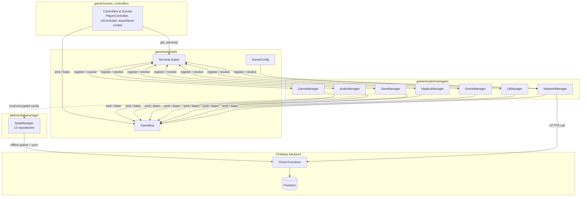
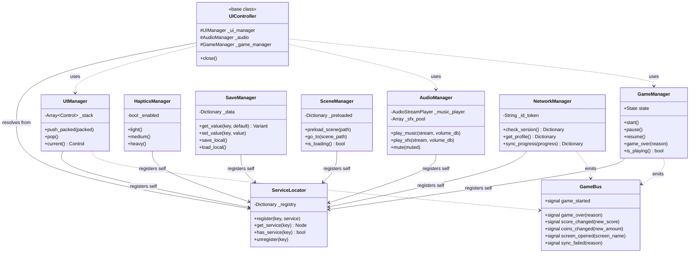
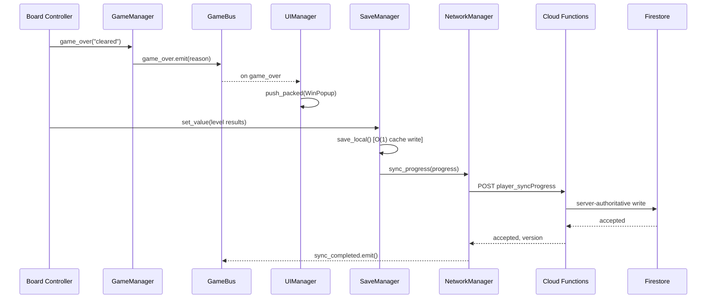

# GodotTemplet

Godot 4.7 game client template — layered-monolith architecture with a
`ServiceLocator` DI hub, offline-first save, and Firebase-backed backend.
Clone this whole repo per new game.

## Repo layout, top to bottom

| Path | What it is |
|---|---|
| `game/` | the entire Godot client — the only folder a game developer needs to touch |
| `addons/` | Godot plugins (`datamanager`, SDK plugins) **and**, currently, the `firebase/` backend package — see the open item below |
| `docs/` | `OPTIMIZATION_GUIDE.md` — the CPU/VRAM/architecture rules this template follows |
| `project.godot`, `firebase.json`, `firestore.rules` | engine + backend config, repo root (Godot and Firebase both require this) |

Everything that used to live under `GameSRC/game/`, `GameSRC/shared/`, and
`GameSRC/src/` now lives in one flat `game/` tree — the old three-way split
mixed a Godot client with stray TypeScript files and didn't earn its
complexity. Within `game/`, scripts sit under `game/scripts/{managers,
controllers, utils}/` — autoloads and scenes/assets stay one level up since
they aren't scripts.

## Architecture at a glance

Every system is a self-initializing `Node` that registers itself with
`ServiceLocator` (`game/autoloads/ServiceLocator.gd`) on `_ready()`. Nothing
holds a direct reference to another node — controllers resolve what they need
via `ServiceLocator.get_service(&"...")`.

**Managers** (add as children of your root/bootstrap scene, `game/scenes/boot/`
— see [docs/OPTIMIZATION_GUIDE.md](docs/OPTIMIZATION_GUIDE.md) §2 for wiring):

| Manager | Job |
|---|---|
| `GameManager` | top-level state machine (idle/playing/paused/game over) |
| `AudioManager` | music + pooled SFX |
| `HapticsManager` | vibration/feedback triggers |
| `SaveManager` | local encrypted save, O(1) in-memory cache |
| `SceneManager` | async threaded scene loading with preload cache |
| `UIManager` | on-demand panel instantiate/free |
| `NetworkManager` | Firebase Cloud Function calls |

**Autoloads:** `ServiceLocator`, `GameBus` (global signal bus), `GameConfig`
(build stage / backend URLs / feature flags), `Logger`.

## Prototype → MFW → HFW, without restructuring

Hypercasual content matures in stages — **Prototype** (is the core loop fun at
all), **MFW** *Minimum Fun Worthy* (the loop is fun with placeholder
everything), **HFW** *Highly Fun Worthy* (fully skinned, ready for soft
launch). The mistake to avoid is giving each stage its own folder tree — that
forks the codebase three ways and someone has to merge them back together
later. This template stays one tree at every stage; only `game/scenes/ui/`
splits by fidelity, because UI/UX is the one thing that actually gets rebuilt
wholesale between stages while the gameplay code underneath doesn't:

```
game/scenes/ui/
├─ mfw/   grey-box panels — build your win/lose/menu screens here first
└─ hfw/   fully skinned replacements — same UIManager.push_packed() call,
          just point it at the hfw/ scene once art lands
```

Everything else scales by adding content, not by adding structure:

| Stage | What you touch |
|---|---|
| **Prototype** | `game/scenes/gameplay/` + whichever managers the core loop needs. Skip menus — hardcode a start. |
| **MFW** | Add `game/scenes/boot/`, `home/`, `loading/`, and placeholder panels under `scenes/ui/mfw/`. Wire `SaveManager` so progress persists. |
| **HFW** | Replace `scenes/ui/mfw/` panels with their `scenes/ui/hfw/` counterparts. Turn on `NetworkManager` sync, analytics, and monetization signals via `GameConfig.BUILD_STAGE`. |

No manager, autoload, or top-level folder is added or removed between stages —
`GameConfig.Stage { PROTOTYPE, STAGING, PRODUCTION }` already gates backend
behavior the same way; this just extends that one-codebase principle to
content and UI.

## Code structure & flow (UML)

### Folder & script structure

The actual on-disk layout — where each script lives, grouped by folder.

```mermaid
flowchart TD
    ROOT["GodotTemplet/"] --> PG["project.godot"]
    ROOT --> FBJSON["firebase.json ⚠ holds schema, not CLI config"]
    ROOT --> FSR["firestore.rules"]
    ROOT --> PKG["package.json"]
    ROOT --> TSC["tsconfig.base.json"]
    ROOT --> DOCS["docs/"]
    DOCS --> OPT["OPTIMIZATION_GUIDE.md"]

    ROOT --> GAME["game/"]

    GAME --> GAUTO["autoloads/"]
    GAUTO --> SL["ServiceLocator.gd"]
    GAUTO --> BUSF["GameBus.gd"]
    GAUTO --> CFGF["GameConfig.gd"]
    GAUTO --> LOGF["Logger.gd"]

    GAME --> GSCRIPTS["scripts/"]

    GSCRIPTS --> GMGR["managers/"]
    GMGR --> GM["GameManager.gd"]
    GMGR --> AM["AudioManager.gd"]
    GMGR --> HM["HapticsManager.gd"]
    GMGR --> SM["SaveManager.gd"]
    GMGR --> SCM["SceneManager.gd"]
    GMGR --> UM["UIManager.gd"]
    GMGR --> NM["NetworkManager.gd"]

    GSCRIPTS --> GCTRL["controllers/"]
    GCTRL --> CAM["CameraController.gd"]
    GCTRL --> PLR["PlayerController.gd"]
    GCTRL --> UICTRL["UIController.gd"]

    GSCRIPTS --> GUTILS["utils/"]
    GUTILS --> PU["PlatformUtils.gd"]

    GAME --> GSCENES["scenes/"]
    GSCENES --> SBOOT["boot/ — bootstrap, wires every manager"]
    GSCENES --> SHOME["home/"]
    GSCENES --> SPLAY["gameplay/"]
    GSCENES --> SLOAD["loading/"]
    GSCENES --> SUI["ui/"]
    SUI --> SMFW["mfw/ — placeholder panels"]
    SUI --> SHFW["hfw/ — polished panels"]

    GAME --> GASSETS["assets/"]
    GASSETS --> GAUDIO["audio/"]
    GASSETS --> GFONTS["fonts/"]
    GASSETS --> GSPRITES["sprites/"]
    GSPRITES --> GATLAS["atlases/ — animations, node_specific"]
    GSPRITES --> GSINGLE["single/ — ui, shared"]
    GSPRITES --> GBG["backgrounds/"]

    ROOT --> ADDONS["addons/"]
    ADDONS --> AFB["firebase/ ⚠ TS backend package, not a Godot plugin"]
```



### Component flow — who talks to whom

Controllers never hold a reference to a manager directly — everything is
resolved through `ServiceLocator`, and every cross-system event goes through
`GameBus`. `NetworkManager` is the only manager allowed to reach the backend;
`SaveManager` is the only one allowed to touch local disk, with the
`datamanager` addon sitting behind it for offline-first cloud sync once it's
wired in (see the integration guide for the fix that folder needs first).



*`Logger` is omitted above for clarity — every manager writes through it.*

### Class structure



### Example flow — level complete

The path a single "level cleared" event takes, start to finish — local save
first, then optimistic UI, then server-authoritative sync:



## Optimization conventions

This template follows a fixed set of CPU/VRAM/architecture rules — texture
atlas policy, folder-by-asset-type layout, idle-node process gating, panel vs.
scene loading strategy, DI/SOLID/time-complexity rules, and VRAM compression
targets. They're documented in full, with a pointer to where each rule is
implemented, in **[docs/OPTIMIZATION_GUIDE.md](docs/OPTIMIZATION_GUIDE.md)**.
Code comments across the codebase (`# PDF §4 CPU`, `# PDF §5 (Big scenes)`, ...)
reference that file's section numbers directly — keep them in sync when editing.

## Known open items

- `firebase.json` still holds the player-data schema instead of real Firebase
  CLI config — that's a content fix, not a structural one, and hasn't been
  done yet. Move that JSON to `schemas/player-data.schema.json` before running
  `firebase init` / `firebase deploy` / `firebase emulators:start` for real.
- `addons/firebase/` is a TypeScript backend package, not a Godot plugin —
  Godot's own convention is that `addons/<name>/` means `plugin.cfg` +
  GDScript/GDExtension. It moved back here from `packages/firebase/`
  intentionally; `package.json`'s `workspaces` array still lists
  `"packages/firebase"`, which no longer exists on disk — update one side or
  the other before running `npm install` at the root.
- The `gameAnalytics`, `meta`, and `yodo1Max` integration stub files (each a
  one-line re-export of a logger and 3 middleware modules) were removed
  entirely rather than relocated — there's currently no placeholder for those
  three SDK integrations anywhere in the repo.

---

# Unified Game Data Persistence & Cloud Synchronization Framework (Godot 4.x)

A production-grade, offline-first data persistence and cloud synchronization framework for Godot 4.x, implementing the studio's **Unified Game Data Model** specification (`android_users/{uid}` and `ios_users/{uid}`).

---

## 🚀 Quick Setup: Dropping into Any New Game

Follow these 6 steps to integrate this framework into any new Godot 4.x project:

### Step 1: Copy the Addon Folder
Copy the entire `addons/datamanager/` folder into your new Godot project's root:
```
res://addons/datamanager/
```

---

### Step 2: Enable the Plugin & Autoloads
In the Godot Editor, go to **Project -> Project Settings -> Plugins** and enable **DataManager**.

*Or alternatively, add this to your new project's `project.godot` file:*
```ini
[autoload]
DataManagerConfig="*res://addons/datamanager/autoload/Config.gd"
DataManagerSignals="*res://addons/datamanager/autoload/Signals.gd"
SyncManager="*res://addons/datamanager/autoload/SyncManager.gd"
DataManager="*res://addons/datamanager/autoload/DataManager.gd"

[editor_plugins]
enabled=["res://addons/datamanager/plugin.cfg"]
```

---

### Step 3: Initialize the Bootstrapper on Startup
In whatever script runs first when your game boots up (e.g. `GameService.gd`, `Main.gd`, or your root startup node):

```gdscript
func _ready() -> void:
    # 1. Instantiate the Unified Bootstrapper
    var bootstrapper = UnifiedBootstrapper.new()
    bootstrapper.name = "UnifiedBootstrapper"
    add_child(bootstrapper)
```

> **What this does automatically:**
> - Registers all 13 unified data buckets into memory (`identity`, `profile`, `device`, `metadata`, `session`, `settings`, `progression`, `economy`, `inventory`, `liveOps`, `stats`, `tutorials`, `monetization`).
> - Loads existing local disk saves into cache (or creates fresh defaults).
> - Increments session counts and tracks player screen time.

---

### Step 4: Wire Auth Lifecycle (Login / Logout)
Whenever your game's authentication system (Firebase, Guest, Google Play Games, Apple Game Center) completes login or logout:

```gdscript
# When player logs in:
DataManagerSignals.login_changed.emit(player_uid, true)

# When player logs out / session ends:
DataManagerSignals.login_changed.emit("", false)
```

> **What this does automatically:**
> - Sets the user ID and credentials in the `identity` repository.
> - Automatically triggers cloud synchronization (downloading cloud backup and performing conflict resolution).

---

### Step 5: (Optional) Plug in a Custom Backend
If your game uses a custom backend (REST API, Supabase, Nakama, Custom WebSocket), inject your adapter:

```gdscript
# If you implemented a custom adapter extending ICloudStorage:
DataManager.set_cloud_storage(MyCustomBackendAdapter.new())
```
*(If omitted, it uses the built-in `FirestoreStorage` engine which works seamlessly offline and with standard Firestore).*

---

### Step 6: Use Player Data Anywhere in Your Game

```gdscript
# --- Economy Example ---
var economy = DataManager.get_repository("economy") as EconomyRepository
if economy:
    economy.add_currency("coins", 500)
    DataManager.save()

# --- Progression Example ---
var progression = DataManager.get_repository("progression") as ProgressionRepository
if progression:
    progression.complete_level(5, 3) # Level 5, 3 stars
    DataManager.save()

# --- Stats Example ---
var stats = DataManager.get_repository("stats") as StatsRepository
if stats:
    stats.record_match(true) # Win
    DataManager.save()

# --- Metadata Example ---
var metadata = DataManager.get_repository("metadata") as MetadataRepository
if metadata:
    metadata.set_value("favorite_mode", "endless")
    DataManager.save()
```

---

## 📦 The 13 Unified Data Buckets & Repositories

| # | Bucket Name | Model Class | Repository Class | Description |
|---|---|---|---|---|
| 1 | `identity` | `IdentityData` | `IdentityRepository` | User UID, Auth Provider, Sign-in state, Email, FCM token |
| 2 | `profile` | `ProfileData` | `ProfileRepository` | Display name, custom name flag, avatar ID, frame ID, badge ID, country code |
| 3 | `device` | `DeviceData` | `DeviceRepository` | Installed app version & device info |
| 4 | `metadata` | `MetadataData` | `MetadataRepository` | Schema version, revision counter, created/login/saved timestamps, dirty map |
| 5 | `session` | `SessionData` | `SessionRepository` | Total screen time, session count, first/last session UTC dates |
| 6 | `settings` | `SettingsData` | `SettingsRepository` | Music, SFX, Haptics, Volume levels, Notifications, Locale |
| 7 | `progression` | `ProgressionData` | `ProgressionRepository` | Current level, highest unlocked level, level stars map, XP, achievements |
| 8 | `economy` | `EconomyData` | `EconomyRepository` | Multi-currency (Coins, Gems, Energy, Custom), refill timers, overdraft guards |
| 9 | `inventory` | `InventoryData` | `InventoryRepository` | Equipped cosmetics, consumables, items map, booster counts |
| 10 | `liveOps` | `LiveOpsData` | `LiveOpsRepository` | Daily reward streak/claim timestamps, active events, battle pass tier |
| 11 | `stats` | `StatsData` | `StatsRepository` | Matches played, matches won, win streaks, custom game statistics |
| 12 | `tutorials` | `TutorialsData` | `TutorialsRepository` | Map of seen tutorials, complete tutorial flags |
| 13 | `monetization` | `MonetizationData` | `MonetizationRepository` | Payer flag, total spend USD, purchase history ledger, Remove Ads status |

---

## 🧪 Running Automated Unit Tests

This addon includes a complete standalone test suite. You can run it via the Godot console:

```powershell
# 1. Run Unified Models & Repositories Test Suite (46 Tests)
godot --headless --path . -s addons/datamanager/tests/UnifiedModelsTest.gd

# 2. Run Core Framework Integration Test Suite (12 Tests)
godot --headless --path . addons/datamanager/tests/DataFrameworkTest.tscn
```

