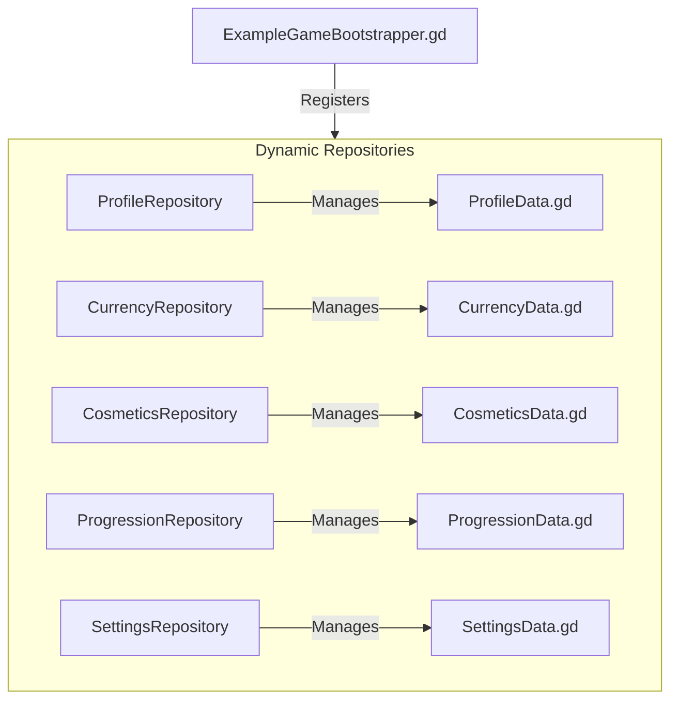

# Godot Data Persistence & Synchronization: Pogo-Pencil Example

This folder contains a complete reference implementation demonstrating how to integrate the **Data Management Framework** into a production Godot project. 

The structure, variables, and sync flows in this folder are directly modeled after the commercial game **Pogo-Pencil-Godot**.

---

## 📁 Architecture Mapping

In the original game, all player data (stats, currencies, badges, customization items, quest progress) was saved locally using a Unity-like `PlayerPrefs` wrapper. This data was then serialized into a single monolithic string `player_data` and saved to Firestore under a single record.

Our framework decomposes this monolithic save file into **five modular, highly-focused repositories and models**, optimizing performance, local disk I/O, and cloud database write costs:

---

## 🧩 Folder Contents

*   **`models/`**: Defines typed dataclasses inheriting from `BaseModel`. They define how data is structured, serialized, deep-cloned, and compared:
    *   [ProfileData.gd](file:///c:/Users/CT_USER/Desktop/datamanager/addons/datamanager/example/models/ProfileData.gd): Usernames, FTUE states, and ads status.
    *   [CurrencyData.gd](file:///c:/Users/CT_USER/Desktop/datamanager/addons/datamanager/example/models/CurrencyData.gd): Gold coins, silver stamps, gold stamps, and purchased powerup items.
    *   [CosmeticsData.gd](file:///c:/Users/CT_USER/Desktop/datamanager/addons/datamanager/example/models/CosmeticsData.gd): Custom pencil skins, trail particles, landing impacts, and ad watch counts.
    *   [ProgressionData.gd](file:///c:/Users/CT_USER/Desktop/datamanager/addons/datamanager/example/models/ProgressionData.gd): High scores, jumps count, distance traveled, unlocked badges, and achievement tiers. **Demonstrates Schema Version 2 and Migration upgrades.**
    *   [SettingsData.gd](file:///c:/Users/CT_USER/Desktop/datamanager/addons/datamanager/example/models/SettingsData.gd): Audio volume level, screen resolutions, and vsync toggles. **Demonstrates Local-Only persistent data.**
*   **`repositories/`**: Subclasses of `BaseRepository` that handle the local caching and specific data mutations:
    *   `ProfileRepository.gd`, `CurrencyRepository.gd`, `CosmeticsRepository.gd`, `ProgressionRepository.gd`, `SettingsRepository.gd`.
*   **`bootstrapper/`**:
    *   [ExampleGameBootstrapper.gd](file:///c:/Users/CT_USER/Desktop/datamanager/addons/datamanager/example/bootstrapper/ExampleGameBootstrapper.gd): Demonstrates registering repositories, configuring autosave loops, subscribing to login signals, and running async cloud-to-local synchronization. **Demonstrates setting and getting synced key-value metadata.**
    *   [OfflineCommandRegistry.gd](file:///c:/Users/CT_USER/Desktop/datamanager/addons/datamanager/example/bootstrapper/OfflineCommandRegistry.gd): Demonstrates how to register offline action replays (like spending currencies or completing levels offline) that will be processed incrementally when reconnection succeeds.
*   **`ui/`**:
    *   [ExampleConflictPopup.gd](file:///c:/Users/CT_USER/Desktop/datamanager/addons/datamanager/example/ui/ExampleConflictPopup.gd): A mock script showing how to pause the synchronization pipeline, show a GUI selection panel comparing Guest and Cloud records, and return the chosen save file dynamically.

---

## ⚡ Integration Best Practices

1.  **Read-cache directly**: Gameplay scripts do not do file I/O. They call `DataManager.get_repository("Currency").get_data()` to query variables instantly.
2.  **Mark Dirty**: When mutating cache variables, always call `mark_dirty()` on the repository so the autosave loop knows it needs to be written to disk.
3.  **Use Transactions**: When performing multiple grouped updates (like spending coins and unlocking a skin at the same time), wrap them in `DataManager.begin_transaction()` and `DataManager.commit_transaction()`.
